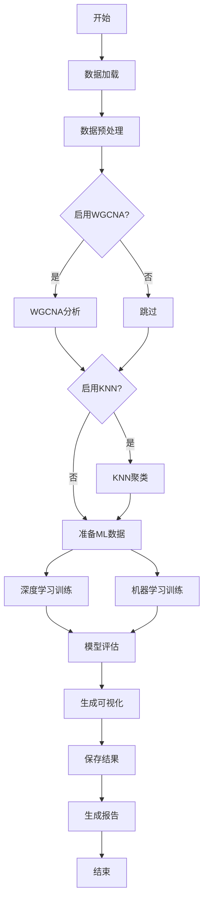

# Drone-embryogenesis_ML
Deep learning
# Enhanced Gene Expression Analysis System V3.0
## 简介

Enhanced Gene Expression Analysis System V3.0 是一个综合性的基因表达数据分析工具，整合了多种先进的机器学习和深度学习方法，用于基因表达模式识别、共表达网络构建和生物标志物发现。

### 核心特性

-  **WGCNA分析**：加权基因共表达网络分析
-  **KNN聚类**：基于密度的无监督聚类细化
-  **深度学习**：11种神经网络模型
-  **机器学习**：8种传统机器学习算法
-  **可视化**：30+种专业级科学可视化
-  **报告生成**：自动化HTML综合分析报告

---

## 主要功能

### 1. 网络分析模块

#### WGCNA (Weighted Gene Co-expression Network Analysis)
```python
# 核心功能
- 自动软阈值选择
- 拓扑重叠矩阵(TOM)计算
- 层次聚类与动态树切割
- 模块识别与合并
- 模块特征基因提取
```

**关键参数：**
- `--soft_power`: 软阈值幂次（0为自动检测）
- `--min_module_size`: 最小模块大小（默认30）
- `--merge_cut_height`: 模块合并阈值（默认0.25）
- `--network_type`: 网络类型（unsigned/signed/signed_hybrid）
- `--deep_split`: 树切割深度（0-3）

#### KNN无监督聚类
```python
# 核心功能
- 局部密度计算
- 密度峰值识别
- 簇扩展算法
- 自适应参数选择
```

**关键参数：**
- `--n_neighbors`: 近邻数量（默认10）
- `--min_cluster_size`: 最小簇大小（默认5）
- `--knn_method`: 聚类方法（standard/adaptive）

### 2. 机器学习模块

#### 深度学习模型（11个）

| 模型 | 架构特点 | 适用场景 |
|------|---------|---------|
| **RNN** | 基础循环神经网络 | 时序依赖建模 |
| **LSTM** | 长短期记忆网络 | 长期依赖捕获 |
| **BiLSTM** | 双向LSTM | 上下文信息利用 |
| **GRU** | 门控循环单元 | 轻量级时序建模 |
| **CNN** | 一维卷积网络 | 局部模式识别 |
| **ResNet** | 残差网络 | 深层特征学习 |
| **Transformer** | 注意力机制 | 全局依赖建模 |
| **AttentionRNN** | 注意力+RNN | 关键位置聚焦 |
| **TCN** | 时间卷积网络 | 因果序列建模 |
| **WaveNet** | 门控卷积 | 序列生成 |
| **InceptionTime** | 多尺度卷积 | 多分辨率特征 |

#### 机器学习模型（8个）

| 模型 | 类型 | 特点 |
|------|------|------|
| **Random Forest** | 集成学习 | 强鲁棒性，特征重要性 |
| **Gradient Boosting** | 集成学习 | 高准确率，顺序优化 |
| **AdaBoost** | 集成学习 | 自适应权重调整 |
| **Extra Trees** | 集成学习 | 极度随机化 |
| **SVM** | 支持向量机 | 高维数据处理 |
| **KNN** | 实例学习 | 简单直观 |
| **Logistic Regression** | 线性模型 | 可解释性强 |
| **Naive Bayes** | 概率模型 | 快速训练 |

### 3. 可视化模块

#### 网络可视化
- **基因网络图**：Cytoscape风格的交互网络
- **TOM热图**：拓扑重叠矩阵可视化
- **模块树图**：层次聚类树状图
- **特征基因相关性**：模块间关系热图

#### 表达模式可视化
- **时序分析图**：彩色趋势线+置信区间
- **热图分析**：原始值、Z-score、层次聚类三视角
- **箱线图**：分组差异+显著性检验
- **雷达图**：模型性能多维对比

#### 模型性能可视化
- **神经网络架构图**：圆形节点可视化
- **混淆矩阵**：分类性能详解
- **学习曲线**：训练过程追踪
- **过拟合分析**：训练集vs测试集对比
- **PR权衡图**：精确率-召回率关系

---

## 系统架构

```
Enhanced Gene Expression Analysis System V3.0
│
├── 数据预处理层
│   ├── 数据加载 (CSV/TSV自动识别)
│   ├── 质量控制 (零表达/低表达/低方差过滤)
│   ├── 标准化 (Log2转换, Z-score)
│   └── 分组整合
│
├── 网络分析层
│   ├── WGCNA模块
│   │   ├── 软阈值选择
│   │   ├── 邻接矩阵计算
│   │   ├── TOM计算
│   │   ├── 模块识别
│   │   └── 特征基因提取
│   │
│   └── KNN聚类模块
│       ├── 密度计算
│       ├── 峰值识别
│       └── 簇扩展
│
├── 机器学习层
│   ├── 深度学习引擎 (PyTorch)
│   │   ├── 模型构建
│   │   ├── 训练优化
│   │   ├── 早停机制
│   │   └── 模型导出
│   │
│   └── 传统机器学习 (Scikit-learn)
│       ├── 集成学习
│       ├── 支持向量机
│       └── 概率模型
│
├── 可视化层
│   ├── 网络图 (NetworkX + Matplotlib)
│   ├── 统计图 (Seaborn + Matplotlib)
│   └── 交互报告 (HTML)
│
└── 输出管理层
    ├── 目录结构创建
    ├── 结果保存 (CSV/JSON/PNG/PDF)
    └── 报告生成 (HTML)
```

---

## 安装指南

### 环境要求

```bash
# Python版本
Python >= 3.7

# 操作系统
Windows / Linux / macOS
```

### 依赖安装

#### 方式一：使用requirements.txt

```bash
# 创建虚拟环境（推荐）
conda create -n gene_analysis python=3.9
conda activate gene_analysis

# 安装依赖
pip install -r requirements.txt
```

**requirements.txt:**
```txt
numpy==1.24.3
pandas==2.0.3
torch==2.0.1
scikit-learn==1.3.0
scipy==1.11.1
matplotlib==3.7.2
seaborn==0.12.2
networkx==3.1
joblib==1.3.1
```

#### 方式二：手动安装

```bash
# 核心包
pip install numpy pandas scipy

# 机器学习
pip install torch scikit-learn

# 可视化
pip install matplotlib seaborn

# 其他
pip install networkx joblib
```

### 可选依赖

```bash
# 更好的Venn图支持
pip install matplotlib-venn

# GPU支持（CUDA 11.8示例）
pip install torch torchvision torchaudio --index-url https://download.pytorch.org/whl/cu118
```

### 验证安装

```bash
python gene_analysis.py --help
```

---

## 使用方法

### 基本用法

```bash
python gene_analysis.py -i expression.csv -g groups.txt
```

### 完整分析（推荐）

```bash
python gene_analysis.py \
    -i expression.csv \
    -g groups.txt \
    --wgcna \
    --soft_power 6 \
    --min_module_size 30 \
    --knn \
    --n_neighbors 10 \
    --epochs 200 \
    --learning_rate 0.001 \
    --export_models
```

### 快速测试

```bash
# 小数据集测试
python gene_analysis.py \
    -i small_dataset.csv \
    -g groups.txt \
    --epochs 50 \
    --test_size 0.3
```

### 高性能配置

```bash
# 多核并行 + GPU加速
python gene_analysis.py \
    -i large_dataset.csv \
    -g groups.txt \
    --wgcna \
    --knn \
    --n_jobs -1 \
    --batch_size 64
```

---

## 输入文件格式

### 1. 表达矩阵 (expression.csv)

**格式要求：**
- 行：基因
- 列：样本
- 第一列：基因ID
- 数值：表达量（原始counts或标准化值）

**示例：**
```csv
Gene_ID,Sample1,Sample2,Sample3,Sample4
Gene_A,100.5,120.3,95.2,110.8
Gene_B,50.2,55.1,48.9,52.3
Gene_C,200.1,210.5,195.3,205.7
...
```

**支持的分隔符：**
- 自动识别：`,` `;` `\t` ` `
- 手动指定：`--sep comma/tab/space`

### 2. 分组文件 (groups.txt)

**格式要求：**
- 两列：Sample_ID, Group
- 必须包含表头
- 样本ID必须与表达矩阵匹配

**示例：**
```txt
Sample_ID    Group
Sample1      T0
Sample2      T0
Sample3      T1
Sample4      T1
Sample5      T2
Sample6      T2
```

**支持的分组类型：**
- 时间点：T0, T1, T2, ...
- 处理组：Control, Treated, ...
- 生物条件：WT, Mutant, ...
- 任意文本标签

---

## 输出结果

### 目录结构

```
analysis_results_20240101_120000/
│
├── 📊 wgcna_analysis/                    # WGCNA分析结果
│   ├── wgcna_soft_threshold.png          # 软阈值选择图
│   ├── wgcna_gene_dendrogram.png         # 基因聚类树
│   ├── wgcna_tom_heatmap.png             # TOM热图
│   ├── module_statistics.png             # 模块统计
│   ├── module_eigengene_correlations.png # 特征基因相关性
│   ├── wgcna_modules.csv                 # 模块分配表
│   └── module_eigengenes.csv             # 特征基因矩阵
│
├── 🎯 knn_clustering/                    # KNN聚类结果
│   ├── knn_clustering.csv                # 聚类结果表
│   └── integrated_clustering.csv         # 整合聚类表
│
├── 🤖 models/                            # 模型专用文件夹
│   ├── RNN/
│   │   ├── RNN_performance.png           # 性能图
│   │   ├── RNN_predictions_with_expression.csv
│   │   └── RNN_summary.json
│   ├── LSTM/
│   ├── CNN/
│   └── ... (每个模型独立文件夹)
│
├── 🧠 neural_network_architectures/      # 神经网络架构图
│   ├── RNN_architecture_circular.png
│   ├── LSTM_architecture_circular.png
│   └── ... (所有DL模型)
│
├── 📉 overfitting_analysis/              # 过拟合分析
│   ├── RNN_overfitting_analysis.png
│   ├── LSTM_overfitting_analysis.png
│   └── ...
│
├── 📈 time_series_analysis/              # 时序分析
│   └── time_series_analysis_enhanced.png
│
├── 📊 boxplot_analysis/                  # 箱线图分析
│   ├── RNN_boxplot_analysis.png
│   ├── LSTM_boxplot_analysis.png
│   └── ...
│
├── 🔥 heatmap_analysis/                  # 热图分析
│   ├── RNN_heatmap_analysis.png
│   ├── LSTM_heatmap_analysis.png
│   └── ...
│
├── 🌐 networks/                          # 基因网络
│   ├── gene_network.png                  # 主网络
│   ├── gene_network.gml                  # Cytoscape格式
│   ├── network_T0.png                    # 各时间点网络
│   ├── network_T1.png
│   ├── network_genes_boxplot_significance.png
│   └── network_statistics.json
│
├── 📊 visualizations/                    # 综合可视化
│   ├── comprehensive_model_analysis.png  # 四合一分析图
│   ├── model_comparison_bars.png         # 模型对比
│   ├── model_radar_charts.png            # 雷达图
│   ├── precision_recall_tradeoff.png     # PR曲线
│   ├── expression_pattern_analysis.png   # 表达模式
│   ├── cluster_centers_heatmap.png       # 聚类中心
│   └── key_genes_patterns.png            # 关键基因模式
│
├── 🔍 intersection_analysis/             # 交集分析
│   ├── models_venn_diagram.png           # Venn图
│   ├── gene_overlap_analysis.png         # 重叠分析
│   └── intersection_genes.csv            # 交集基因列表
│
├── 💾 data/                              # 数据文件
│   ├── group_means.csv                   # 组均值
│   ├── gene_clusters.csv                 # 基因聚类
│   ├── key_genes.csv                     # 关键基因
│   ├── model_performance.csv             # 模型性能表
│   ├── model_results.json                # 结果JSON
│   ├── preprocessing_stats.json          # 预处理统计
│   ├── intersection_genes.csv            # 交集基因
│   └── {Model}_predictions.csv           # 各模型预测
│
├── 📝 reports/                           # 报告文件
│   ├── comprehensive_analysis_report.html # HTML报告
│   └── analysis_summary.json             # 摘要JSON
│
├── 💼 exported_models/                   # 导出的模型
│   ├── RNN/
│   │   └── RNN_model.pth
│   ├── LSTM/
│   │   └── LSTM_model.pth
│   ├── RandomForest/
│   │   └── RandomForest_model.joblib
│   └── ...
│
└── directory_structure.json              # 目录结构索引
```

### 关键输出文件说明

#### 1. 模块分配文件 (wgcna_modules.csv)
```csv
Gene,Module
Gene_A,turquoise
Gene_B,blue
Gene_C,brown
...
```

#### 2. 模型性能表 (model_performance.csv)
```csv
Model,Accuracy,Precision,Recall,F1,Training_Time
LSTM,0.9234,0.9156,0.9234,0.9189,45.23
CNN,0.9123,0.9045,0.9123,0.9078,32.15
...
```

#### 3. 关键基因列表 (key_genes.csv)
```csv
gene,pattern,slope,r_squared,max_change,cv,score,cluster
Gene_X,Strong_Increasing,1.234,0.89,2.5,0.15,25.6,1
Gene_Y,Peak,0.345,0.76,3.2,0.22,18.9,2
...
```

#### 4. 预测结果 (predictions_with_expression.csv)
```csv
gene,true_label,predicted_label,correct,true_pattern,predicted_pattern,expr_Sample1,...
Gene_A,0,0,True,Increasing,Increasing,100.5,...
Gene_B,2,2,True,Peak,Peak,200.1,...
...
```

---

## 参数详解

### 必需参数

| 参数 | 类型 | 说明 |
|------|------|------|
| `-i, --input` | 字符串 | 表达矩阵文件路径 |
| `-g, --groups` | 字符串 | 分组文件路径 |

### WGCNA参数

| 参数 | 类型 | 默认值 | 说明 |
|------|------|--------|------|
| `--wgcna` | 标志 | False | 启用WGCNA分析 |
| `--soft_power` | 整数 | 0 | 软阈值幂次（0=自动） |
| `--min_module_size` | 整数 | 30 | 最小模块大小 |
| `--merge_cut_height` | 浮点 | 0.25 | 模块合并阈值 |
| `--network_type` | 选择 | unsigned | 网络类型 |
| `--deep_split` | 整数 | 2 | 树切割深度(0-3) |

### KNN参数

| 参数 | 类型 | 默认值 | 说明 |
|------|------|--------|------|
| `--knn` | 标志 | False | 启用KNN聚类 |
| `--n_neighbors` | 整数 | 10 | 近邻数量 |
| `--min_cluster_size` | 整数 | 5 | 最小簇大小 |
| `--knn_method` | 选择 | standard | 聚类方法 |

### 深度学习参数

| 参数 | 类型 | 默认值 | 说明 |
|------|------|--------|------|
| `--epochs` | 整数 | 100 | 训练轮数 |
| `--learning_rate` | 浮点 | 0.001 | 学习率 |
| `--batch_size` | 整数 | 32 | 批量大小 |
| `--hidden_size` | 整数 | 64 | 隐藏层大小 |
| `--dropout` | 浮点 | 0.3 | Dropout率 |
| `--num_layers` | 整数 | 2 | RNN层数 |
| `--patience` | 整数 | 20 | 早停耐心值 |

### 其他参数

| 参数 | 类型 | 默认值 | 说明 |
|------|------|--------|------|
| `--test_size` | 浮点 | 0.2 | 测试集比例 |
| `--val_size` | 浮点 | 0.2 | 验证集比例 |
| `--n_clusters` | 整数 | 6 | K-means聚类数 |
| `--output_prefix` | 字符串 | analysis | 输出前缀 |
| `--export_models` | 布尔 | True | 导出模型 |
| `--n_jobs` | 整数 | -1 | 并行作业数 |

---

## 分析流程

### 完整流程图



### 详细步骤

#### Step 1: 数据加载与预处理
1. **文件读取**
   - 自动检测分隔符
   - 验证文件格式
   - 加载表达矩阵和分组信息

2. **质量控制**
   - 移除零表达基因
   - 过滤低表达基因（< 3个样本表达 > 阈值）
   - 过滤低方差基因（< 10%分位数）

3. **标准化**
   - Log2转换（如果需要）
   - 样本-分组匹配
   - 计算组均值和标准差

#### Step 2: WGCNA分析
1. **软阈值选择**
   ```python
   # 自动选择最佳幂次
   # 目标：R² > 0.85
   # 范围：1-20
   ```

2. **网络构建**
   - 计算邻接矩阵
   - 计算TOM矩阵
   - 层次聚类

3. **模块识别**
   - 动态树切割
   - 模块合并
   - 特征基因提取

#### Step 3: KNN聚类
1. **密度计算**
   ```python
   density = 1 / (mean_knn_distance + epsilon)
   ```

2. **峰值识别**
   - 寻找局部密度最大值
   - 密度阈值过滤

3. **簇扩展**
   - 基于密度可达性
   - 考虑种子密度比例

#### Step 4: 机器学习
1. **数据准备**
   - 特征提取（组均值）
   - 标签生成（模式分类）
   - 数据划分（训练/验证/测试）

2. **深度学习训练**
   - 11个模型并行训练
   - 早停机制
   - 学习率调度
   - 模型验证

3. **传统机器学习**
   - 8个算法训练
   - 交叉验证（可选）
   - 超参数优化（可选）

#### Step 5: 评估与可视化
1. **性能评估**
   - 准确率、精确率、召回率、F1
   - 混淆矩阵
   - 训练时间

2. **可视化生成**
   - 30+种图表
   - PDF + PNG格式
   - 高分辨率输出

3. **报告生成**
   - HTML综合报告
   - JSON数据摘要
   - CSV结果表格

---


## 常见问题

### Q1: 内存不足怎么办？

**问题：** 分析大型数据集时内存溢出

**解决方案：**
```bash
# 1. 增加虚拟内存
# 2. 分批处理
# 3. 减少模块大小
python gene_analysis.py \
    -i large_data.csv \
    -g groups.txt \
    --min_module_size 50 \  # 增大最小模块
    --batch_size 16         # 减小批量大小
```

### Q2: WGCNA找不到合适的软阈值？

**问题：** R²始终低于0.85

**解决方案：**
```bash
# 1. 手动指定幂次
--soft_power 12

# 2. 降低R²阈值（在代码中修改RsquaredCut）

# 3. 使用signed网络
--network_type signed
```

### Q3: 模型训练太慢？

**解决方案：**
```bash
# 1. 减少训练轮数
--epochs 50

# 2. 启用GPU
# 自动检测，无需设置

# 3. 减少模型数量
# 注释掉不需要的模型（在代码中）

# 4. 并行计算
--n_jobs -1
```

### Q4: 找不到共同样本？

**问题：** "No matching samples between expression data and group file"

**解决方案：**
```bash
# 1. 检查样本名格式
# 表达矩阵列名必须与分组文件Sample_ID完全一致

# 2. 去除空格
sed 's/ //g' groups.txt > groups_clean.txt

# 3. 统一大小写
```

### Q5: 可视化图表不显示中文？

**解决方案：**
```python
# 在代码开头添加：
import matplotlib.pyplot as plt
plt.rcParams['font.sans-serif'] = ['SimHei']  # Windows
plt.rcParams['font.sans-serif'] = ['Arial Unicode MS']  # macOS
```

### Q6: GPU未被使用？

**检查：**
```python
import torch
print(torch.cuda.is_available())  # 应返回True
print(torch.cuda.get_device_name(0))  # 显示GPU名称
```

**安装CUDA版PyTorch：**
```bash
# CUDA 11.8
pip install torch --index-url https://download.pytorch.org/whl/cu118

# CUDA 12.1
pip install torch --index-url https://download.pytorch.org/whl/cu121
```

---

## 高级用法

### 1. 自定义模型

```python
# 在代码中添加新模型
class CustomModel(nn.Module):
    def __init__(self, input_size, num_classes=4):
        super(CustomModel, self).__init__()
        # 定义层
        self.fc1 = nn.Linear(input_size, 128)
        self.fc2 = nn.Linear(128, num_classes)
    
    def forward(self, x):
        x = torch.relu(self.fc1(x))
        return self.fc2(x)

# 添加到模型字典
dl_models['Custom'] = CustomModel(input_size=n_features)
```

### 2. 批量分析

```bash
#!/bin/bash
# batch_analysis.sh

for dataset in data/*.csv; do
    python gene_analysis.py \
        -i "$dataset" \
        -g "${dataset%.csv}_groups.txt" \
        --wgcna --knn \
        --output_prefix "$(basename $dataset .csv)"
done
```

### 3. 参数网格搜索

```python
# 修改代码启用网格搜索
--grid_search  # 传递参数

# 在代码中定义参数网格
param_grid = {
    'n_estimators': [50, 100, 200],
    'max_depth': [5, 10, 15],
    'min_samples_split': [2, 5, 10]
}
```

---

## 性能优化建议

### 硬件配置

| 组件 | 最低配置 | 推荐配置 | 大数据配置 |
|------|---------|---------|-----------|
| CPU | 4核心 | 8核心 | 16核心+ |
| RAM | 8GB | 16GB | 32GB+ |
| GPU | 无 | GTX 1060 | RTX 3090 |
| 存储 | HDD | SSD | NVMe SSD |

### 数据规模指南

| 基因数 | 样本数 | 预计时间 | 推荐配置 |
|--------|--------|---------|---------|
| < 5,000 | < 50 | 10-30分钟 | 最低配置 |
| 5,000-10,000 | 50-100 | 30分钟-2小时 | 推荐配置 |
| 10,000-20,000 | 100-200 | 2-6小时 | 大数据配置 |
| > 20,000 | > 200 | 6小时+ | 服务器配置 |

---


